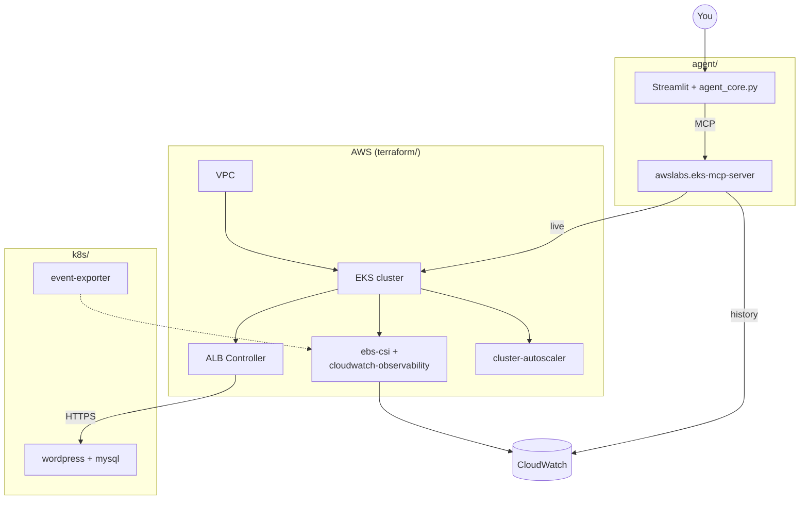
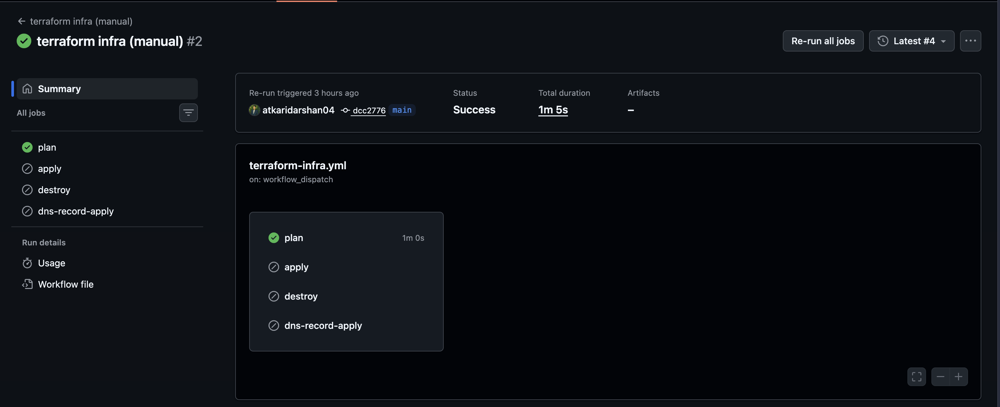
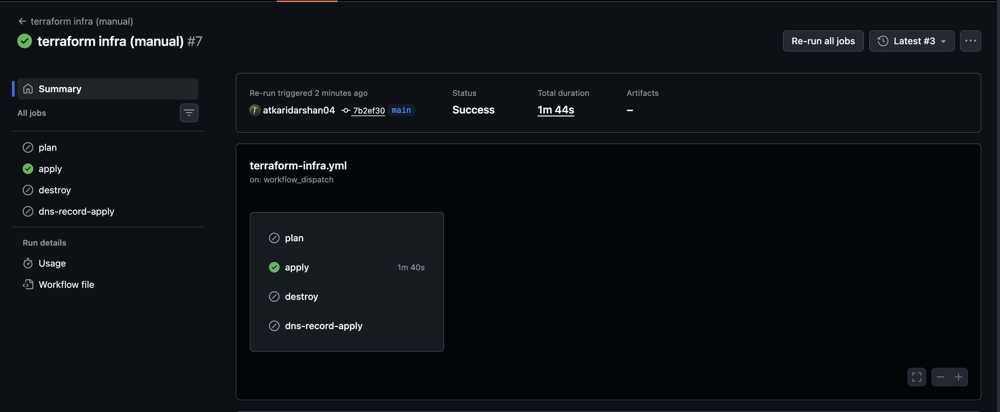
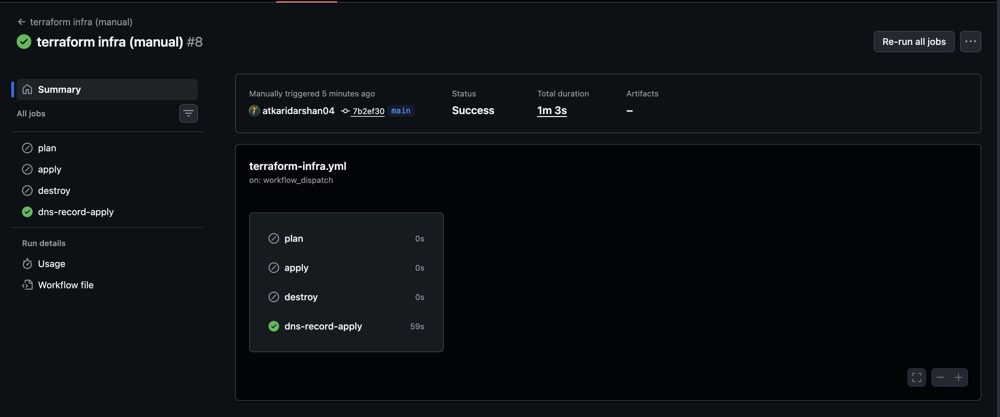
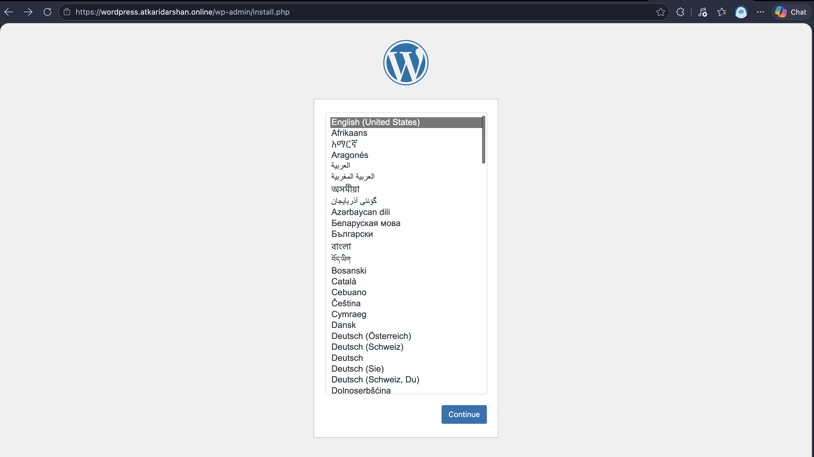
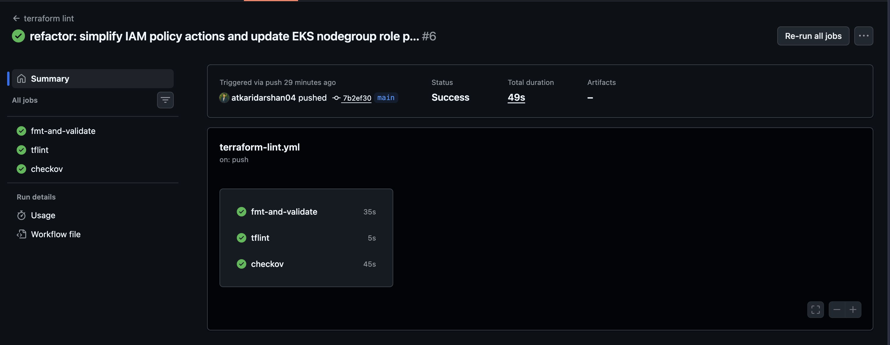
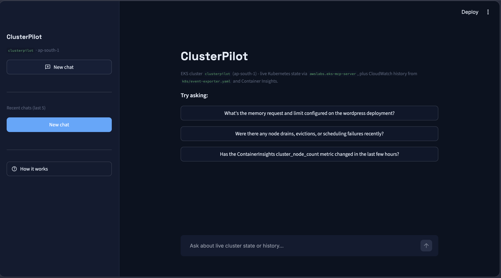

# clusterpilot

A production-grade EKS platform built entirely from infrastructure-as-code
- network, cluster, and a sample application - with CI/CD and cluster
operations built on AWS/GitOps best practices: EKS Pod Identity-scoped IAM
per addon, GitOps deploys via ArgoCD, cluster autoscaling, policy-as-code
CI (checkov/tflint), and short-lived OIDC credentials for CI instead of any
long-lived AWS key.

On top of that platform: an AI agent that can answer "what's happening on
this cluster right now" against both live cluster state and its CloudWatch
history.

## Layout

```bash
clusterpilot/
├── terraform/       # all AWS infra - see terraform/README.md
├── k8s/             # app manifests + cross-cutting policy - see k8s/README.md
├── agent/           # standalone chat agent, live state + CloudWatch history - see agent/README.md
└── docs/
    ├── architecture.md   # full system diagram + request-path walkthrough
    └── concepts/         # the non-obvious mechanisms this repo relies on, explained
```

**`agent/`** is the chat interface for this cluster - a standalone local
script that bridges OpenAI's tool-calling to AWS's own `eks-mcp-server` MCP
server, answering questions against both _live_ k8s state and CloudWatch
history in one conversation. Cluster history (a node drain, an autoscaler
scale-up/down, past events in general) is persisted continuously for it to
query: the `amazon-cloudwatch-observability` EKS addon
(`terraform/modules/eks-addons`) persists node/pod metrics and container
logs into CloudWatch, and `k8s/event-exporter.yaml` forwards Kubernetes
Events into that same pipeline. See
[`docs/concepts/mcp-agent-architecture.md`](docs/concepts/mcp-agent-architecture.md)
for how that's wired together.

Headlamp (installed via `k8s/README.md`'s Headlamp step) is a plain
read-only dashboard for live cluster state - it has no chat interface here;
that's `agent/`'s job.

## Architecture

See [`docs/architecture.md`](docs/architecture.md) for the full system
diagram, the two request paths through this system (the app itself vs. the
tools used to operate it), and the module dependency graph. Short version:



## Getting started

Three docs, followed in order - the full run sequence, in case you don't
want to read all three linearly first:

1. `terraform/README.md` [steps 1-7](terraform/README.md#1-bootstrap-remote-state-and-the-ci-role) -
   bootstrap remote state + the GitHub Actions OIDC role, apply VPC/EKS/
   platform addons, connect kubectl, bastion, ArgoCD, verify the ALB
   controller/cert/other addons.
2. [`k8s/README.md`](k8s/README.md) - apply the StorageClass and Headlamp
   by hand; the demo app, HPA/PDB/NetworkPolicy, and event-exporter sync on
   their own via ArgoCD once step 1 is done. This is what makes the ALB
   controller actually create the ALB.
3. `terraform/README.md` [step 8](terraform/README.md#8-point-dns-at-the-alb) -
   point DNS at the now-real ALB.
4. [`agent/README.md`](agent/README.md) - the standalone chat agent, once
   the above are up and `k8s/event-exporter.yaml` is applied.
5. `terraform/README.md` [step 9](terraform/README.md#9-tear-down) /
   [`k8s/README.md`](k8s/README.md#tear-down) - tear-down, k8s objects
   before the underlying infra.

Read each doc in full before running its steps - this list is a map of the
order, not a substitute for the detail in each one. For background on the
non-obvious mechanisms this project relies on (why pods-per-node has a
hard ceiling, how EKS Pod Identity scopes credentials per addon, how CI authenticates
without a stored AWS key, and more), see
[`docs/concepts/`](docs/concepts/README.md).

## CI/CD

Two workflows, deliberately kept separate since they have nothing in
common except both touching `terraform/`:

| Workflow | File | Trigger | AWS access | Purpose |
|---|---|---|---|---|
| Infra | `terraform-infra.yml` | Manual (`workflow_dispatch`) | Yes, via OIDC | `plan`/`apply`/`destroy` the platform, point DNS at the ALB |
| Lint | `terraform-lint.yml` | Automatic (push/PR touching `terraform/**`) | No | `fmt`/`validate`, `tflint`, `checkov` (+ SARIF upload) |

### One-time repo setup (infra workflow only)

| Name | Kind | Where it comes from |
|---|---|---|
| `AWS_OIDC_ROLE_ARN` | Repo variable, required | `terraform/bootstrap`'s `github_actions_role_arn` output - see [`docs/concepts/github-actions-oidc.md`](docs/concepts/github-actions-oidc.md) |
| `SSH_PUBLIC_KEY` | Repo secret, required | The bastion's public SSH key |
| `ARGOCD_REPO_TOKEN` | Repo secret, optional | A GitHub PAT - only needed if your fork is private; leave unset for a public fork and ArgoCD clones anonymously |

Set these under **Settings -> Secrets and variables -> Actions**; the full
walkthrough is in `terraform/README.md`'s "Bootstrap remote state and the
CI role" step. The lint workflow needs none of this - it never touches AWS.

### Infra workflow

Each `action` (`plan`/`apply`/`destroy`/`dns-record-apply`) runs as its own
job, so the Actions UI shows exactly which one ran; a `concurrency` group
stops two dispatches from racing each other; `plan` (and the preview plan
inside `apply`) writes the resource diff to the run's job summary instead
of leaving it buried in step logs. No GitHub Environments/approval gate in
front of `apply`/`destroy` (that needs GitHub Pro/Team/Enterprise on a
private repo) - be deliberate about which `action` you dispatch.

| Action | What it does |
|---|---|
| `plan` / `apply` | `apply` always runs `-target=module.vpc -target=module.eks` first, then a full apply - a no-op once the cluster exists, see [`docs/concepts/eks-cluster-bootstrapping.md`](docs/concepts/eks-cluster-bootstrapping.md). `plan` can only preview that same vpc+eks layer until the cluster is real. |
| `destroy` | Destroys `dns-record` first, then deletes the Ingress and waits for the real ALB to disappear before destroying everything else - Terraform has no visibility into the ALB itself, so this can't be expressed as a dependency. See [`docs/concepts/alb-networking-and-network-policy.md`](docs/concepts/alb-networking-and-network-policy.md). |
| `dns-record-apply` | Its own action rather than auto-chained after `apply` - the ALB is provisioned asynchronously, so there's no reliable point mid-run to know it exists yet. Run it once `kubectl get ingress app` shows an `ADDRESS`. |





Now access the site at `https://<your-domain>` (`local.domain_name` in `terraform/locals.tf`) -
HTTPS via the ACM cert `terraform/modules/dns` provisions, served through
the ALB the ingress controller creates:



After you're done, tear it down by re-running the same workflow with the `destroy` action instead.

### Lint workflow

Runs `fmt -check`/`validate`, `tflint` (provider-specific correctness), and
`checkov` (security/misconfiguration, config in `terraform/.checkov.yaml`).
The `checkov` job also uploads its findings as SARIF to the repo's
**Security -> Code scanning** tab. See
[`docs/concepts/policy-as-code-checkov-tflint.md`](docs/concepts/policy-as-code-checkov-tflint.md)
for what each check actually catches and how the SARIF upload works, and
`terraform/README.md`'s "Local checks" section to run all three yourself
before pushing.



## Working with the agent

The standalone chat agent ([`agent/README.md`](agent/README.md)) answers a
question with a visible tool call, reaching live cluster state and
CloudWatch history in one conversation.


