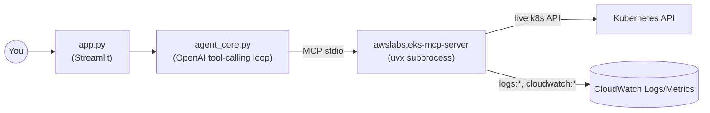

# Standalone cluster agent

A local Streamlit chat app for the `clusterpilot` EKS cluster -
live Kubernetes state and CloudWatch history in one conversation, running on
your own machine. Every turn shows exactly which tools got called, with what
arguments, and what came back, so an answer is never just an unverifiable
claim.

## Layout

```
agent/
├── agent_core.py       # the engine: MCP connection, tool-calling loop, system prompt - UI-agnostic
├── app.py              # Streamlit UI - the only file that imports agent_core and knows it's on a screen
├── .streamlit/
│   └── config.toml     # theme (colors/font) - picked up automatically by `streamlit run`
├── requirements.txt
└── agent.log           # audit trail (gitignored) - see "Seeing what it did" below
```

## How it works



`agent_core.py` is an OpenAI tool-calling loop that speaks the MCP protocol
as a _client_ to [`awslabs.eks-mcp-server`](https://github.com/awslabs/mcp/tree/main/src/eks-mcp-server)
(AWS's own official, actively-maintained MCP server), which it launches
itself as a `uvx` subprocess. No hand-rolled tools, no LangChain - one
official upstream server providing everything:

- **Live cluster state**: `list_k8s_resources`, `manage_k8s_resource` (read),
  `get_pod_logs`, `get_k8s_events` - current pod specs, resource
  requests/limits, current status, current logs.
- **History**: `get_cloudwatch_logs` (`log_type="application"` is exactly
  where `../k8s/event-exporter.yaml`'s forwarded Kubernetes Events live -
  node drains, evictions, scheduling failures, autoscaler scale up/down)
  and `get_cloudwatch_metrics` (the `ContainerInsights` namespace from
  `../terraform/modules/eks-addons`'s CloudWatch Observability addon).

Read-only by design, same posture as every other agent in this project -
the server is launched **without** `--allow-write`, so `manage_k8s_resource`
(create/replace/patch/delete), `apply_yaml`, and `generate_app_manifest`
are unavailable. `--allow-sensitive-data-access` **is** passed, since
`get_pod_logs`/`get_k8s_events`/`get_cloudwatch_logs` need it - that flag
also covers reading Kubernetes Secrets, broader than ideal, but there's no
finer-grained toggle in this server and this cluster's only Secret is the
demo `mysql-pass`.

`app.py` reconnects to `eks-mcp-server` fresh on every question rather than
holding one connection open across the whole session - simpler than
threading a persistent connection through Streamlit's rerun-the-whole-script
execution model, at the cost of ~1-2s of `uvx` subprocess startup per
question. Revisit if that latency ever actually matters.

## 1. Install dependencies

```bash
pip install -r requirements.txt
```

`uv`/`uvx` also need to be installed (the MCP server runs via `uvx`, no
separate package install step) - see [astral.sh/uv](https://docs.astral.sh/uv/getting-started/installation/).

## 2. Run it with your existing AWS profile

The agent uses whichever AWS profile is active in your shell - no dedicated
IAM role wired up by default. Reading CloudWatch log _content_ back needs
`logs:StartQuery`/`GetQueryResults` on top of the write/metadata actions
(`CreateLogGroup`/`CreateLogStream`/`PutLogEvents`/`Describe*`) the
addons' own Pod Identity roles carry; a personal profile with broad `logs:*`
access covers this without extra setup.
`../terraform/modules/agent-role` is the least-privilege role for this
agent specifically (scoped to exactly the read actions it needs, see its
`eks-mcp-iam-policy.json`) - not wired into `main.tf` by default so the
quickstart above needs zero extra IAM setup; wire it in and pass its
`role_arn` via `AWS_PROFILE`/an assumed-role credential process once you
want the agent running under its own least-privilege identity instead of
your own.

```bash
export OPENAI_API_KEY="sk-..."
export AWS_PROFILE=<your AWS profile>

streamlit run app.py
```

Opens in your browser. First question downloads `awslabs.eks-mcp-server`
from PyPI via `uvx` - needs internet, takes a few seconds, one-time.

Good test questions:

```text
What's the memory request and limit configured on the wordpress deployment?          # live
Has the ContainerInsights cluster_node_count metric changed in the last few hours?   # history
Were there any node drains, evictions, or scheduling failures recently?       # history
```

The last question exercises the full point of this agent: it calls
`get_cloudwatch_logs` against `k8s/event-exporter.yaml`'s forwarded
Kubernetes Events, so it can answer about a node drain or scale-down that
already scrolled out of live `kubectl get events` (etcd only keeps Events
for ~1h).

## UI

- **Multiple chats**: sidebar "New chat" starts a fresh conversation; the
  last 5 stay listed below it (titled from their first question, the
  current one highlighted), click one to switch back - all in-memory for
  this running `streamlit` process, nothing persisted to disk, so they
  reset if you restart it.
- **Suggested questions**: a fresh, empty chat shows one-click example
  questions instead of a blank box.
- **Live vs. history badges**: every tool call shows a **live** or
  **history** pill next to it - the same split this whole project is
  built around, visible at a glance instead of having to remember which
  tool name means which.
- **Icons**: Streamlit's built-in Material Symbols (`:material/...:`
  shorthand) for buttons/expanders/inline markers, and its default
  user/assistant chat avatars - no emoji standing in for an icon anywhere.
- **Theme**: a dark palette built around that same live (blue `#4FA8FF`) /
  history (violet `#B98BFF`) split rather than arbitrary accent colors -
  `.streamlit/config.toml` sets the base theme, `app.py` layers in Space
  Grotesk for the title (kept to headings only) and a few small,
  version-safe CSS tweaks (targeting Streamlit's stable `data-testid`
  attributes, not its internal hashed classes).

## Seeing what it did

Each answer shows a collapsible status block - "Used N tool call(s)" or
"Answered directly" - listing every tool called (with its live/history
badge), its arguments, and a preview of what came back, so you can confirm
which capability it actually reached for instead of trusting the answer's
content alone.

For a durable record across sessions, `agent_core.py` also writes a plain,
append-only audit trail to `agent.log` (gitignored) - one line per question,
one line per tool call (name, args, a result preview), one line per final
answer, nothing else. The `eks-mcp-server` subprocess's own internal
logging (loguru/rich chatter - "Processing request of type...", "Using
cached boto3 client...") is suppressed at the source via
`FASTMCP_LOG_LEVEL=ERROR` rather than captured anywhere; genuine subprocess
errors still surface in the terminal running `streamlit run app.py`.

## Notes

- IAM-mode Kubernetes API access (the default `eks-mcp-server` uses) needs
  your principal to have either created the cluster or have an EKS access
  entry - already true here, since `enable_cluster_creator_admin_permissions
= true` in `../terraform/modules/eks/main.tf` grants whoever ran `apply`
  cluster-admin via an access entry.
- If a tool call comes back `AccessDenied` even under your own profile,
  check whether it needs `iam:*` actions (`get_policies_for_role`/
  `add_inline_policy` do) or `cloudformation:*` (`manage_eks_stacks`
  describe does) - neither is needed for live state or CloudWatch history,
  which is all this agent actually uses.
