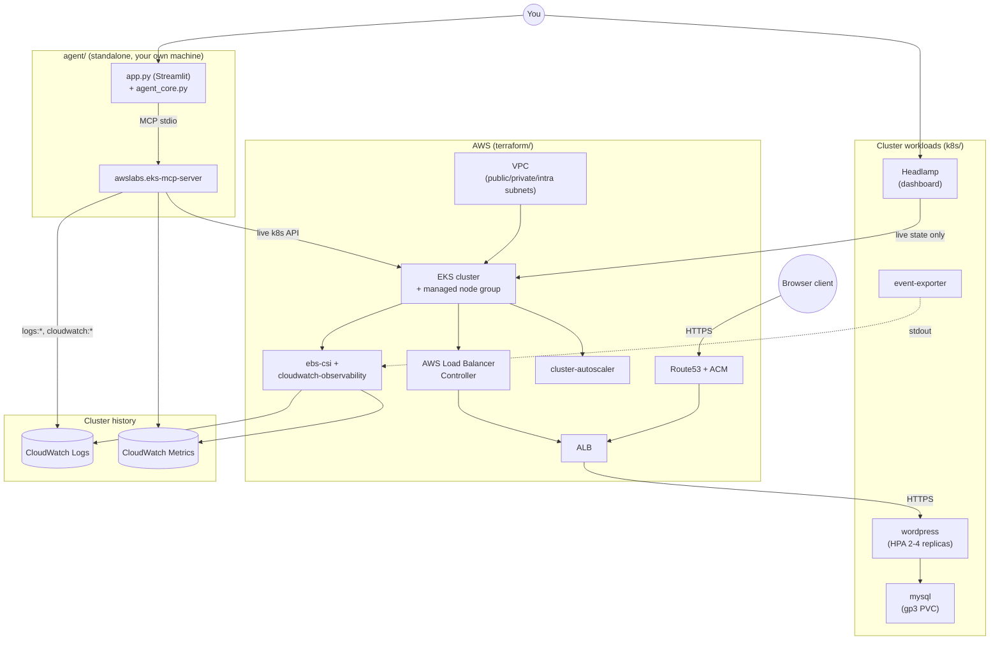
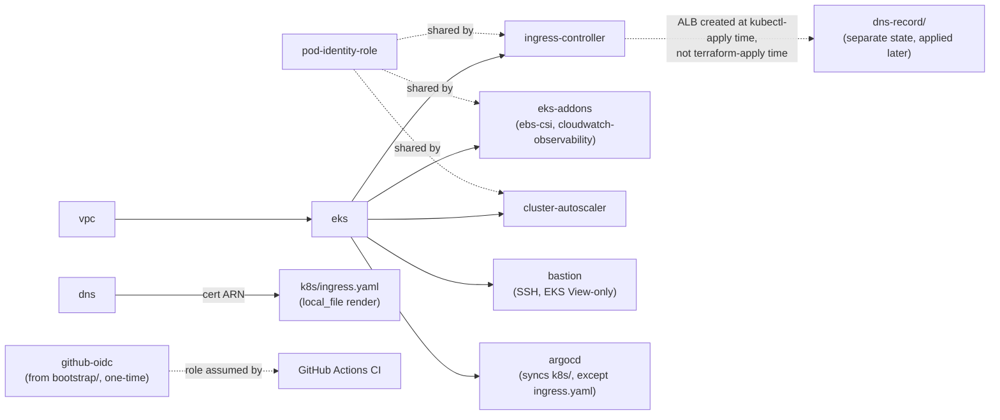

# Architecture

## System diagram

`AWS` is what `terraform/` provisions, `K8s` is what `k8s/` applies on top
(mostly via ArgoCD - see
[concepts/gitops-with-argocd.md](concepts/gitops-with-argocd.md)),
`History` is the persistence layer that survives past etcd's short Event
TTL, `Agent` is what actually queries all of it in one conversation.

## The two request paths through this system

**The app itself** (top-left to middle): browser → Route53 → the ALB
(created dynamically by the AWS Load Balancer Controller, TLS-terminated
with the ACM cert) → the `wordpress` Service/pods → `mysql`. This is the
only path a real end user's request takes.

**Operating the cluster** (bottom): Headlamp and the standalone agent are
both separate, human-operated tools that talk to the cluster's live API
and/or CloudWatch - neither sits in the app's request path, and neither
one is reachable by an end user hitting the public domain. Headlamp only
ever reads live cluster state for its dashboard; the agent is the one
component that reaches both live state and CloudWatch history in the same
conversation.

## Why cluster state has to be exported to be queryable

Kubernetes Events (a node drain, an autoscaler scale-up, a scheduling
failure) live in etcd for roughly an hour by default, then they're gone -
`kubectl get events` has nothing left to show. `k8s/event-exporter.yaml`
watches the Events API and re-emits every event to its own stdout; the
`amazon-cloudwatch-observability` addon's Fluent Bit daemonset (already
tailing every pod's stdout for Container Insights) ships that straight to
CloudWatch Logs with no extra AWS permissions needed on the exporter
itself. That's the entire mechanism behind "the agent can answer questions
about things that already scrolled out of live cluster state" - see
[concepts/mcp-agent-architecture.md](concepts/mcp-agent-architecture.md).

## Module dependency graph (Terraform)

See [`terraform/README.md`](../terraform/README.md) for the full module
layout and the step-by-step apply order, and
[concepts/eks-cluster-bootstrapping.md](concepts/eks-cluster-bootstrapping.md)
for why the first apply needs a two-step `-target` sequence.
