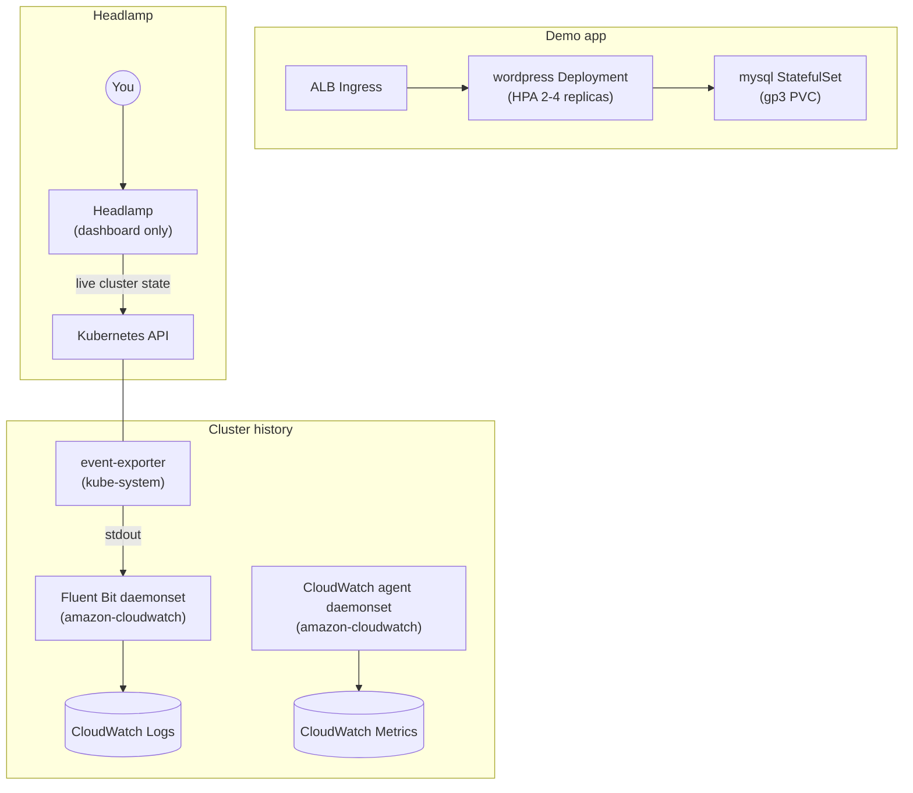
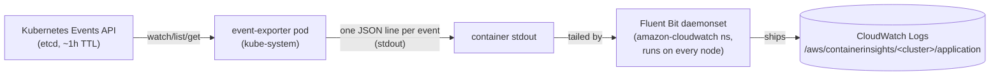

# clusterpilot k8s manifests

The demo app (WordPress + MySQL), its cross-cutting policy (HPA/PDB/
NetworkPolicy), and the event pipeline. Everything here except
`ingress.yaml`/`ingress.yaml.tpl` is synced automatically by ArgoCD once
[`../terraform/README.md`](../terraform/README.md) step 2's apply
completes - see its ArgoCD section. This doc mostly explains what each
manifest does and how to verify/test it, not commands to run.

## Layout

```
k8s/
├── storageclass.yaml       # gp3 StorageClass, default, EBS-backed
├── wordpress-mysql.yaml    # the app: Secret, ServiceAccounts, mysql StatefulSet, wordpress Deployment
├── policies.yaml           # HPA, PodDisruptionBudget, NetworkPolicy for the app above
├── event-exporter.yaml     # forwards Kubernetes Events to stdout, for CloudWatch history (ArgoCD-managed)
├── ingress.yaml.tpl        # ALB Ingress template - edit this, not ingress.yaml
└── ingress.yaml            # rendered by Terraform (local_file) with the real cert ARN - don't edit directly
```

## Architecture



`app` and `history` are independent of each other - the event pipeline
doesn't touch the demo app, it just happens to run in the same cluster.
Headlamp only ever reaches the live Kubernetes API - it's a dashboard, not
a chat interface. The standalone agent (`../agent/README.md`, wired up
from the root README) is the one thing in this project that reaches both
live state and CloudWatch history in one conversation.

## ArgoCD-managed manifests

`storageclass.yaml`, `wordpress-mysql.yaml`, `policies.yaml`, and
`event-exporter.yaml` all sync automatically - nothing to apply by hand.
Check sync status either from `../terraform/README.md`'s ArgoCD section,
or directly:
```
kubectl get application clusterpilot-k8s -n argocd
kubectl get storageclass
kubectl get pods -n default
```
`gp3` should show as `(default)`.

### The demo app

MySQL runs as a StatefulSet (PVC via `volumeClaimTemplates`), WordPress as
a Deployment - deliberately has no PVC, see
`../docs/concepts/storage-and-statefulsets.md` for why. Both run
under their own least-privilege ServiceAccount (no default token mounted)
with liveness/readiness probes and CPU/memory `resources` set (the
wordpress ones are what the HPA below scales against).

`policies.yaml` adds the cross-cutting stuff on top of the app:

- **HPA** on the wordpress Deployment: 2-4 replicas, targets 70% CPU,
  shortened `scaleDown.stabilizationWindowSeconds` (60s vs the 5min
  default) for faster feedback while testing.
- **PodDisruptionBudget**: wordpress only (`minAvailable: 1`). Skipped for
  mysql on purpose - it's a single-replica StatefulSet, so a PDB there
  would just block every voluntary eviction (node drains, upgrades)
  forever instead of protecting anything.
- **NetworkPolicy**: default-deny ingress, then explicit allows -
  wordpress:80 open to any source (the ALB uses `target-type: ip`, so it
  hits pod IPs directly with no in-cluster source to scope the rule to),
  mysql:3306 restricted to wordpress pods only.

### Testing the HPA

```
kubectl get hpa wordpress --watch
```

Load has to originate either from inside the wordpress pods themselves
(e.g. a loop hitting `localhost`) or from the real ALB endpoint
(`https://wordpress.atkaridarshan04.online`) - the backend security
group the AWS Load Balancer Controller manages for `target-type: ip`
Ingresses only accepts :80 from the ALB itself, so traffic from any other
in-cluster pod or Service call never reaches wordpress.

Inside the pods (bypasses the network entirely, always works):

```
kubectl get pods -l app=wordpress,tier=frontend -o jsonpath='{.items[*].metadata.name}'
```

Then for each pod name printed, in its own terminal (or backgrounded with `&`):

```
kubectl exec <pod-name> -- sh -c 'while true; do wget -q -O- http://localhost/ >/dev/null; done'
```

Through the real ALB (exercises the actual request path):

```
for i in $(seq 1 10); do
  ( while true; do curl -s -o /dev/null https://wordpress.atkaridarshan04.online/; done ) &
done
```

Stop either with `kill %1 %2 ...` or `kill $(jobs -p)`.

`REPLICAS` climbs toward `maxReplicas: 4` under load, then settles back to
`2` once load stops and the (shortened) scale-down stabilization window
passes. To also see cluster-autoscaler react, check headroom first
(`kubectl get nodes -o custom-columns=NAME:.metadata.name,ALLOCATABLE_PODS:.status.allocatable.pods`
and `kubectl get pods -A -o wide`) - it only adds nodes once the existing
ones actually run out of room for the extra replicas.

### Cluster history (event-exporter)

Depends on the Fluent Bit daemonset `../terraform/modules/eks-addons`
installs to actually ship anywhere - without it, this still runs fine,
its events just go nowhere past `kubectl logs`.

**Why this exists:** Kubernetes Events (node drains, evictions,
cluster-autoscaler scale up/down) live in etcd for only about an hour by
default - gone before you'd think to ask "what happened." This persists
them past that window.

**How it works, end to end:**



1. `event-exporter` watches the Events API (`get`/`watch`/`list` on
   `events` only) and prints each one as a JSON line to its own stdout -
   never calls any AWS API itself.
2. The Fluent Bit daemonset (`../terraform/modules/eks-addons`) already
   tails every pod's stdout for Container Insights - this output rides
   that same pipe, no extra wiring needed.
3. Fluent Bit ships each line to CloudWatch Logs, log group
   `/aws/containerinsights/<cluster-name>/application` - same group every
   other pod's stdout lands in, distinguished by the
   `kubernetes.pod_name` field Fluent Bit adds.

**Seeing it work**, cheapest/most direct check first:

```
# 1. Is it actually producing anything? (bypasses CloudWatch entirely)
kubectl logs -n kube-system -l app=event-exporter --tail=20

# 2. Is Fluent Bit itself healthy on the same node?
kubectl get pods -n amazon-cloudwatch -o wide

# 3. What streams actually exist in the log group right now?
aws logs describe-log-streams \
  --log-group-name /aws/containerinsights/clusterpilot/application \
  --order-by LastEventTime --descending --limit 10

# 4. Filter for event-exporter's own entries specifically
aws logs filter-log-events \
  --log-group-name /aws/containerinsights/clusterpilot/application \
  --filter-pattern "event-exporter" \
  --limit 5
```

If (4) comes back empty even though (1)-(3) look healthy, it usually just
means no events worth reporting have fired yet - trigger one
(`kubectl delete pod <any-pod>`, or wait for the next HPA/autoscaler
action) and re-check.

## DNS

`ingress.yaml` (rendered from `ingress.yaml.tpl` and applied directly by
Terraform, not ArgoCD - see `../terraform/README.md` step 2) creates the
ALB. Once it exists, go to [`../terraform/README.md`](../terraform/README.md)
step 8 to point the domain at it.

## Headlamp (cluster dashboard)

Installed directly with helm, not through Terraform - unlike the addons in
`terraform/`, Headlamp doesn't call any AWS API, so there's no IAM role for
Terraform to actually provision. It only needs in-cluster RBAC, which
`helm install`/`kubectl` already handle on their own.

Default install is plain Headlamp, no chat plugin - the standalone agent
(`../agent/README.md`) is the main chat interface for this cluster:
```
helm repo add headlamp https://kubernetes-sigs.github.io/headlamp/
helm repo update
helm install my-headlamp headlamp/headlamp --namespace kube-system
```

Port-forward the **Service**, not the pod - the Service already maps its
port `80` to whatever the container's actual port is internally, so this
keeps working across pod replacements (helm upgrades, restarts) without
needing to look up a pod name or container port each time:
```
kubectl port-forward -n kube-system svc/my-headlamp 8080:80 &
```
Visit `http://127.0.0.1:8080`.

Login token, scoped to the built-in `view` ClusterRole (read-only) rather
than `cluster-admin`:
```
kubectl create serviceaccount headlamp-viewer -n kube-system
kubectl create clusterrolebinding headlamp-viewer \
  --clusterrole=view --serviceaccount=kube-system:headlamp-viewer
kubectl create token headlamp-viewer -n kube-system
```

The chart also creates its own default ServiceAccount (`my-headlamp`),
bound to `cluster-admin` via a ClusterRoleBinding it creates itself
(`my-headlamp-admin`) - `kubectl create token my-headlamp -n kube-system`
gets a full-access token from that instead, if you ever need it.

Kept to local port-forward for now rather than exposing it via the ALB -
it's a cluster-admin-adjacent surface (even read-only, it exposes full
cluster topology/config), and putting it on the same internet-facing ALB
as the public demo app would need real justification. Revisit with an
`internal`-scheme Ingress (VPC-only, no public exposure) if always-on
access without a manual port-forward becomes worth it.

To remove: `helm uninstall my-headlamp -n kube-system` (also drop the
ServiceAccount/ClusterRoleBinding above if you created them).

## Tear down

See [`../terraform/README.md`](../terraform/README.md)'s tear-down step -
the k8s objects here need deleting before the underlying infra, in a
specific order.
