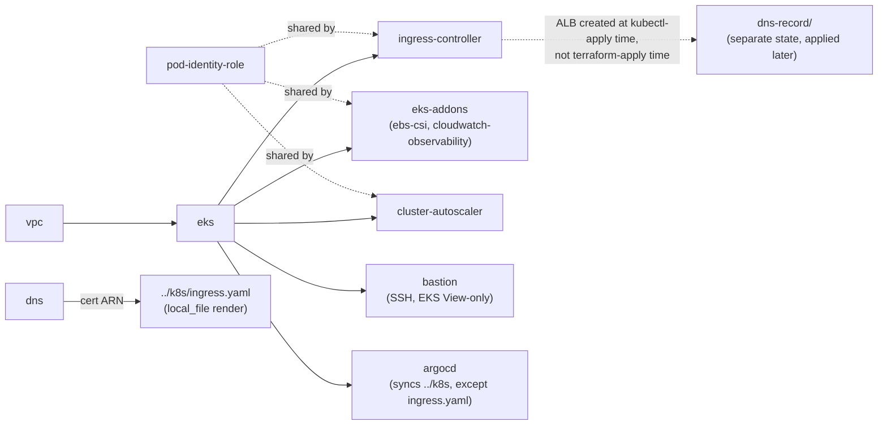

# clusterpilot infrastructure

Terraform for the EKS cluster, ALB ingress, and DNS/TLS that clusterpilot
runs on - VPC + EKS (managed node group) in your own AWS account
(`<AWS_ACCOUNT_ID>`, `ap-south-1`).

App/workload manifests (the demo app, HPA/PDB/NetworkPolicy, Headlamp) live
in [`../k8s/README.md`](../k8s/README.md) - this doc only covers getting
the cluster and its platform addons up.

## Layout

```
terraform/
├── bootstrap/                 # one-time: creates the S3 state bucket (own local state)
│   ├── main.tf
│   ├── outputs.tf
│   └── variables.tf
├── modules/
│   ├── vpc/                   # VPC, public/private/intra subnets
│   ├── eks/                   # EKS cluster + managed node group
│   ├── pod-identity-role/     # shared EKS Pod Identity role, called by the three below
│   ├── ingress-controller/    # aws-load-balancer-controller helm release + its pod identity role
│   ├── eks-addons/            # aws-ebs-csi-driver + amazon-cloudwatch-observability EKS addons, each + its pod identity role
│   ├── cluster-autoscaler/    # cluster-autoscaler helm release + its pod identity role
│   ├── agent-role/            # least-privilege role for agent/ - not wired into main.tf by default
│   ├── github-oidc/           # GitHub Actions OIDC provider + CI role - wired from bootstrap/, not main.tf
│   ├── bastion/               # SSH ops box for kubectl access, EKS View-only
│   ├── argocd/                # GitOps controller for k8s/*.yaml (except ingress.yaml)
│   └── dns/                   # hosted zone lookup + ACM cert (DNS-validated)
├── dns-record/                # separate stage: points the domain at the ALB (own state)
│   ├── main.tf
│   ├── outputs.tf
│   ├── providers.tf
│   └── variables.tf
├── locals.tf                  # single source of truth for cluster/node/domain config
├── main.tf                    # wires vpc -> eks -> ingress-controller, + dns, + local_file renders
├── outputs.tf
├── providers.tf               # backend, aws/helm provider config
└── README.md
```

`modules/dns` and `dns-record/` are deliberately separate: the ALB is created
dynamically by the ingress controller at `kubectl apply` time, not
`terraform apply` time, so anything that depends on it (pointing the domain
at it) can't live in the same config as the cert without an expected
first-run failure. `dns-record/` is applied once, after the ALB exists -
same idea as `bootstrap/` running before the main config, just at the other
end of the timeline.

## Module dependencies



Solid arrows are `depends_on`/data dependencies within this one `apply`.
`dns-record/` is deliberately its own state, applied after the ALB exists
(see below) - not part of this graph's single `apply`.

## Prerequisites

- Terraform >= 1.10 (needed for native S3 state locking)
- AWS credentials, active in your shell (`aws sso login --profile <profile>`)
- `kubectl`
- An SSH key pair for the bastion - generate one if you don't already have one:
  ```
  ssh-keygen -t ed25519 -f ~/.ssh/clusterpilot-bastion
  ```
  Only the **public** half goes into Terraform; the private key stays on
  your machine and is never passed to `terraform`/committed anywhere.
- A GitHub PAT, only if your fork is **private** - ArgoCD's repo-server
  needs it to clone `k8s/`. Leave `variables.tf`'s `argocd_repo_token`
  unset for a public fork; ArgoCD then clones anonymously and no
  credentials Secret gets created in the cluster at all.

## Local checks

What `.github/workflows/terraform-lint.yml` (repo root) runs on
every push/PR touching this directory - worth running yourself before
pushing, since none of these need AWS credentials:

```
terraform fmt -check -recursive          # formatting
terraform init -backend=false && terraform validate   # syntax/internal consistency

tflint --recursive                       # provider-specific correctness (unused vars, deprecated args, ...)

checkov -d .                             # security/misconfiguration - config in .checkov.yaml
```

`tflint` and `checkov` aren't bundled with the Terraform CLI - install
separately (`brew install tflint`, `pip install checkov`, or your
platform's equivalent). A finding you're intentionally keeping (like the
bastion's open SSH ingress in `modules/bastion/main.tf`) gets a
`#checkov:skip=CKV_ID:reason` comment on that resource, not a global
suppression - see `.checkov.yaml` for the one check (`CKV_TF_1`) that *is*
suppressed repo-wide, and why.

## 1. Bootstrap remote state and the CI role

One-time, run with your own admin-level AWS credentials - creates the S3
state bucket *and* the GitHub Actions OIDC provider/role the CI workflows
assume afterward (see
[`docs/concepts/github-actions-oidc.md`](../docs/concepts/github-actions-oidc.md)):

```bash
cd bootstrap
terraform init
terraform apply \
  -var="github_owner=<your-github-username>" \
  -var="github_repo=clusterpilot"
terraform output state_bucket
terraform output github_actions_role_arn
```

Copy the bucket name into `../providers.tf`'s `backend "s3" { bucket = "..." }`
and `dns-record/providers.tf`'s (backend blocks can't use variables, so this
has to be pasted in literally). Set the role ARN as a repo variable so the
CI workflows can assume it: **Settings -> Secrets and variables -> Actions
-> Variables -> New repository variable**, name `AWS_OIDC_ROLE_ARN`.

**If this fails with `EntityAlreadyExists` on the OIDC provider:** the
GitHub Actions OIDC provider is account-wide, not per-repo - AWS allows
only one per (account, issuer URL), so if any other project in this AWS
account has ever set up GitHub Actions OIDC before, one already exists.
Reuse it instead of creating a second one:

```bash
terraform apply \
  -var="github_owner=<your-github-username>" \
  -var="github_repo=clusterpilot" \
  -var="create_github_oidc_provider=false" \
  -var="existing_github_oidc_provider_arn=arn:aws:iam::<account-id>:oidc-provider/token.actions.githubusercontent.com"
```

## 2. Init & apply the main infra

```bash
cd ..
terraform init      # migrates state into the S3 backend

export TF_VAR_ssh_public_key="$(cat ~/.ssh/clusterpilot-bastion.pub)"
export TF_VAR_argocd_repo_token="<your GitHub PAT>"   # Optional if repo is public, required if private

terraform plan  -target=module.vpc -target=module.eks
terraform apply -target=module.vpc -target=module.eks

terraform plan
terraform apply
```

Creates the VPC (public/private/intra subnets across 2 AZs), the EKS cluster,
a managed node group, the AWS Load Balancer Controller (via helm, with an
EKS Pod Identity role), the EBS CSI driver and Amazon CloudWatch
Observability addons (both via `modules/eks-addons`, both EKS-managed, both
Pod Identity), Cluster Autoscaler (helm, Pod Identity), the `metrics-server`
addon (needed for the HPA in
`../k8s/policies.yaml` to read pod CPU), ArgoCD (see below), and the ACM
cert for `wordpress.atkaridarshan04.online`. Also renders `../k8s/ingress.yaml` from the template with the real cert ARN baked in and
applies it directly to the cluster (`kubectl_manifest.ingress`) - don't
edit `ingress.yaml` directly, edit `ingress.yaml.tpl`. It's gitignored, so
this is the one manifest ArgoCD never manages (see the ArgoCD section
below); `kubectl get ingress app -w` to watch for the ALB's `ADDRESS`.

Amazon CloudWatch Observability installs the CloudWatch agent and a Fluent
Bit daemonset into their own `amazon-cloudwatch` namespace - both bundled
with the EKS addon itself, nothing separate to author. `modules/eks-addons`
pre-declares its four log groups (`application`, `dataplane`, `host`,
`performance`) with 30-day retention from the start, rather than the
default "Never Expire." This is what `../k8s/event-exporter.yaml` builds on
for cluster history.

The `vpc-cni` addon has `enableNetworkPolicy: "true"` set - required for
the `NetworkPolicy` objects in `../k8s/policies.yaml` to actually be
enforced; without it they apply cleanly and do nothing.

**Node capacity note:** pods/node is capped by the instance type's ENI/IP
capacity, not `resources.requests` - see
[`docs/concepts/cluster-autoscaling-and-pod-capacity.md`](../docs/concepts/cluster-autoscaling-and-pod-capacity.md)
for the mechanics. Check `kubectl get nodes -o custom-columns=NAME:.metadata.name,ALLOCATABLE_PODS:.status.allocatable.pods`
before adding workloads. `modules/cluster-autoscaler` scales the node
group's ASG for unschedulable pods; `node_desired_size` in `locals.tf`
only affects a fresh node group, not an existing one (the upstream EKS
module ignores changes to it on purpose, so a running autoscaler doesn't
fight Terraform over node count) - bump it live first if you need to raise it:
```bash
aws eks update-nodegroup-config \
  --cluster-name clusterpilot \
  --nodegroup-name <name-from-terraform-error-or-`aws eks list-nodegroups`> \
  --scaling-config minSize=3,maxSize=10,desiredSize=3
```

## 3. Connect kubectl

```bash
aws eks update-kubeconfig --name clusterpilot --region ap-south-1
kubectl get nodes
```

Works immediately - `enable_cluster_creator_admin_permissions = true` grants
whoever ran `apply` cluster-admin via an access entry.

## 4. The bastion

`modules/bastion` is a plain SSH box in a public subnet, `kubectl` installed
(pinned to the cluster's Kubernetes version), for looking at the cluster
without your own laptop's kubeconfig handy:

```bash
ssh -i ~/.ssh/clusterpilot-bastion ec2-user@$(terraform output -raw bastion_public_ip)
aws eks update-kubeconfig --name clusterpilot --region ap-south-1
kubectl get pods -A
```

Its IAM role only carries `eks:DescribeCluster` and an EKS access entry
scoped to `AmazonEKSViewPolicy` - View, not Admin, on purpose (see
[`docs/concepts/irsa-and-pod-identity.md`](../docs/concepts/irsa-and-pod-identity.md)
for why an instance role's blast radius matters). Admin-level changes go
through your own kubectl context (step 3, above), never the bastion.

SSH is open to `local.bastion_ssh_cidr` (`0.0.0.0/0` for now, same posture
as the EKS endpoint's own CIDR) - narrow both to a specific trusted range
once one's settled on.

## 5. ArgoCD

`modules/argocd` installs ArgoCD (lightweight profile - no Dex/SSO,
notifications, or ApplicationSet controller) and one bootstrap
`Application` pointing at `../k8s` in this repo, with automated sync
(`prune` + `selfHeal`) turned on. From this `apply` onward, `wordpress-mysql.yaml`,
`policies.yaml`, and `event-exporter.yaml` are ArgoCD's job, not
`kubectl apply`'s - commit a change to any of them and ArgoCD picks it up
on its own. `ingress.yaml` is the one exception: it's gitignored (rendered
locally with a runtime cert ARN), so ArgoCD never sees it and it stays a
direct `kubectl apply`, same as today.

Reach the UI via port-forward (there's no ingress/LB in front of it):
```bash
kubectl port-forward -n argocd svc/argocd-server 8080:443
```
Then open `https://localhost:8080` - user `admin`, password `admin123`
(hardcoded via `local.argocd_admin_password_bcrypt_hash` for now; change it
by hashing a new one with `htpasswd -nbBC 10 "" <password>`, dropping the
leading colon, and updating that local).

Because `selfHeal` is on, editing or deleting any of the three synced
manifests directly with `kubectl` gets reverted automatically - go through
git instead.

## 6. Verify the ALB controller and the cert

```bash
kubectl get deployment -n kube-system aws-load-balancer-controller
kubectl logs -n kube-system deployment/aws-load-balancer-controller
```

Should show 1/1 ready, no `AccessDenied` in the logs.

```bash
terraform output -raw certificate_arn
aws acm describe-certificate --certificate-arn $(terraform output -raw certificate_arn) --query Certificate.Status
```

`terraform apply` already blocks until ACM reports the cert `ISSUED` (via
`aws_acm_certificate_validation`), so if `apply` finished, it's issued -
this is just how to re-check independently later.

## 7. Verify the EBS CSI driver, Cluster Autoscaler, and CloudWatch Observability

```bash
kubectl get pods -n kube-system -l app.kubernetes.io/name=aws-ebs-csi-driver
kubectl get deployment -n kube-system cluster-autoscaler-aws-cluster-autoscaler
kubectl logs -n kube-system deployment/cluster-autoscaler-aws-cluster-autoscaler | grep -i "discovered\|scale"
kubectl get pods -n amazon-cloudwatch
```

Should show a `cloudwatch-agent` and a `fluent-bit` pod per node, both
`Running`, no `AccessDenied` in `kubectl logs -n amazon-cloudwatch -l name=cloudwatch-agent`.

**Seeing the actual metrics** (separate from the logs `fluent-bit` ships -
this is what `cloudwatch-agent` publishes): CloudWatch console → **Insights
→ Container Insights** → pick **EKS Clusters**/**EKS Nodes**/**EKS Pods**
from the dropdown → `clusterpilot`. These live in the
`ContainerInsights` metrics namespace (`node_cpu_utilization`,
`pod_memory_utilization`, `cluster_node_count`, etc. - dimensioned by
`ClusterName`/`NodeName`/`PodName`/`Namespace`), generated from raw
performance log events in a separate log group from the one
`../k8s/README.md`'s event-exporter step uses:
```bash
aws cloudwatch list-metrics --namespace ContainerInsights \
  --dimensions Name=ClusterName,Value=clusterpilot
```
Raw source data, if you want to query it directly instead of the console
dashboard (log group ends in `performance`, not `application`):
```bash
# CloudWatch Logs Insights, log group: /aws/containerinsights/clusterpilot/performance
STATS avg(node_cpu_utilization) as avg_cpu by NodeName | SORT avg_cpu DESC
```

## Next: deploy the app

Cluster and platform addons are up. **Go to
[`../k8s/README.md`](../k8s/README.md)** to apply the StorageClass, deploy
the demo app, and get the ALB created via the Ingress - then come back here
for step 8 below.

## 8. Point DNS at the ALB

Needs the ALB from the k8s Ingress step above to already exist. Apply the
separate `dns-record/` config to create the Route53 alias record for
`wordpress.atkaridarshan04.online`:

```bash
cd dns-record
terraform init
terraform apply
```

This is its own state (same S3 bucket, separate key) - always a clean apply,
never coupled to whether the main config or the k8s manifests were just
applied. After it propagates (usually under a minute),
`https://wordpress.atkaridarshan04.online` should work end-to-end.

## Next: the standalone cluster agent

With the cluster, addons, and `../k8s/event-exporter.yaml` all up, cluster
history is being persisted. **[`../agent/README.md`](../agent/README.md)**
covers the local chat agent that can actually query it (plus live cluster
state) - no separate IAM setup needed, it uses whatever AWS profile your
`aws`/`kubectl` sessions already authenticate with. `modules/agent-role`
is the least-privilege role scoped to exactly what the agent needs
instead - not wired into `main.tf` by default, see `../agent/README.md`
for when to use it.

## 9. Tear down

`policies.yaml`/`wordpress-mysql.yaml` (ArgoCD-managed) get cleaned up
automatically by `terraform destroy` - deleting the ArgoCD `Application`
resource cascades through everything it syncs (see
[`docs/concepts/gitops-with-argocd.md`](../docs/concepts/gitops-with-argocd.md)).
Only Headlamp still needs a manual step, since it was installed directly
with helm, not Terraform:
```bash
helm uninstall my-headlamp -n kube-system   # if installed
```

The Ingress needs a two-step destroy, though - the ALB it created, and the
two security groups the ALB controller manages alongside it
(`k8s-<namespace>-<ingress>-*` for the ALB itself, `k8s-traffic-<cluster>-*`
for the shared backend-traffic SG), aren't Terraform resources at all -
the controller creates all three dynamically, so Terraform has no way to
know they exist or wait for them. Deleting the Ingress first and
confirming all three are actually gone *before* touching the node
group/VPC avoids leaving orphans that block subnet/Internet
Gateway/VPC deletion for a long time (or indefinitely). From `terraform/`
(needs the same two vars from step 2 exported in this shell -
`ssh_public_key`/`argocd_repo_token` have no defaults):
```bash
cd dns-record && terraform destroy && cd ..

terraform destroy -target=kubectl_manifest.ingress
until [ "$(aws elbv2 describe-load-balancers \
  --query "length(LoadBalancers[?contains(LoadBalancerName, 'k8s-default-app')])" \
  --output text)" = "0" ] && [ "$(aws ec2 describe-security-groups \
  --filters "Name=group-name,Values=k8s-*" \
  --query "length(SecurityGroups)" --output text)" = "0" ]; do
  echo "waiting for the ALB controller to finish cleaning up..."; sleep 10
done

terraform destroy
```

The bootstrap S3 bucket is outside all of this (separate state) - remove it
yourself from `bootstrap/` only if you're done with the account for good.
